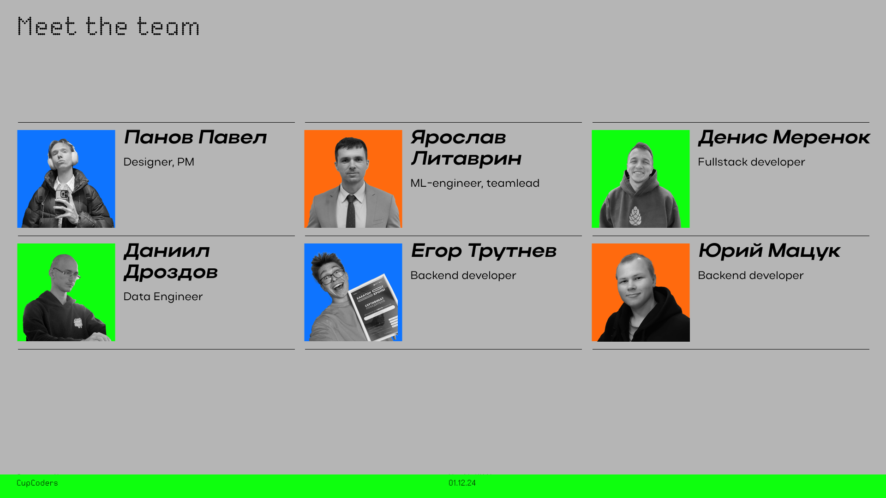

# XAKATOH_S21 12/2024. Проект от заказчика  ["Информационные системы и сервисы"](https://www.isands.ru/company/)

Цель проекта: создание и развертывание приложения для обработки нормативных документов государственных органов, регламентирующих оказание цифровых услуг, парсинга из них необходимой информации и ее суммаризации.

[1. Описание работы приложения](#краткое-описание)

[2. Работа с приложением](#использование-приложения)

[3. Структура репозитория, описание работы модулей](#подробное-описание-структуры-репозитория)

[4. Авторы](README.md#команда)

## Краткое описание

[Основной парсер](src/main_parser) создан на основе веб-фреймворка *Flask*. C его помощью которого реализуется клиент-серверный интерфейс обработки одного или нескольких документов в pdf формате и извлечения релевантной информации. Полученная таким образом информация суммаризируется в виде xlsx [таблицы](results/result_cp1.xlsx). Полученная таблица является своеобразной "контрольной точкой" №1 конвейера обработки. 

Второй этап конвейера основан на применении методов обработки естественного языка с использованием больших языковых моделей. На данном этапе полученная информация дополнительно разделяется на ряд блоков и сохраняется также в табличном виде [(контрольная точка №2)](results/result_cp2.xlsx). Для запуска второго этапа требуется развернуть либо локальную инфраструктуру для работы с большими языковыми моделями наподобие [решения](src/llm_processing/llm_server.py), которое использовалось нами на хакатоне, либо с помощью облачных сервисов наподобии больших языковых моделей [от Сбербанка](https://developers.sber.ru/docs/ru/gigachat/api/overview). Инструкция по разворачиванию локального сервера расположена в папке [здесь](src/llm_processing/README.md).

Большие языковые модели могут быть развернуты "в проде" на различном обобрудовании, в качестве "начальных вариантов" можно указать подобные [сборки](https://tinygrad.org/#tinybox). Альтернативой разворачивания LLM на локально является использование облачных моделей от различных поставщиков: [Сбер](https://developers.sber.ru/docs/ru/gigachat/api/tariffs), [Яндекс](https://yandex.cloud/ru/docs/foundation-models/pricing).

Заключительная обработка организуется либо на основе алгоритмического подхода с использованием [скрипта обработки](src/editStrOnExcelWithMarker/SplitOnStr_And_LoadWithTitle.py), либо при использовании LLM. Получившиеся результаты с использованием обоих методов выгружены в папку results ([1](results/result_cp3_v1.xlsx), [2](results/result_cp3_v3.xlsx)). В связи с тем, что обработке подлежит нормативная документация, более предпочтительным является использование алгоритмического метода. Описание использования соответствующего скрипта находится [здесь](src/editStrOnExcelWithMarker/README.md)

## Использование приложения

Для запуска основного сервера конвейера предобработки необходимо ознакомиться с файлом [README.md](src/server/README.md).

Для запуска конвейера обработки с использованием LLM необходимо обеспечить инфраструктуру для развертывания большой языковой модели на локальном сервере. На хакатоне использовалась модель [Qwen/Qwen2.5-14B-Instruct](https://huggingface.co/Qwen/Qwen2.5-14B-Instruct) с квантизацией Q3, для повторяемости результата рекомендуется использовать её. После запуска и настройки локального или облачного сервера с моделью, необходимо воспользоваться [обработчиком](src/llm_processing/llm_preproc.py) с учетом корректировки в нем параметров доступа к серверу. Инструкция по корректировке и тестовый сценарий запуска обработчика имеются в ipynb [блокноте](src/llm_processing/llm_preproc_test.ipynb).

Скрипт финальной предобработки на основе регулярных выражений находится в файле [SplitOnStr_And_LoadWithTitle.py](src/editStrOnExcelWithMarker/SplitOnStr_And_LoadWithTitle.py) 

## Команда

